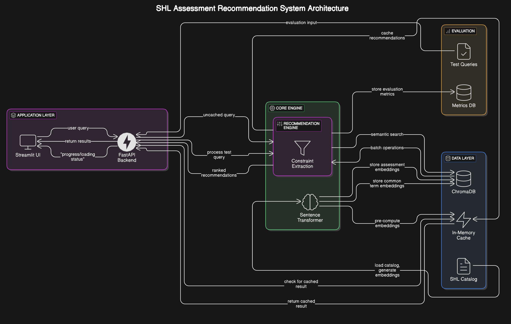

# SHL Assessment Recommendation System - Architecture

## System Overview

The SHL Assessment Recommendation System is a comprehensive solution designed to help HR professionals find relevant assessment tests for candidates using natural language queries. The system leverages NLP techniques and semantic search to match user requirements with the most appropriate assessments from the SHL catalog.

## Architecture Diagram

## Key Components

### 1. Data Layer

- **SHL Catalog (JSON)**: Stores structured data about assessments including name, URL, description, duration, type, remote and adaptive support.
- **Vector Database (ChromaDB)**: Stores vector embeddings for each assessment, enabling semantic similarity search.
- **Cache System**: In-memory cache for query results, improving response times for repeated queries.

### 2. Core Engine

- **Sentence Transformer**: ML model that converts text to vector embeddings for semantic similarity search.
- **Recommendation Engine**: Central component that orchestrates the recommendation process, combining semantic search with constraint-based filtering.
- **Constraint Extraction**: Analyzes queries to extract specific requirements like duration, skills, and test types.

### 3. Application Layer

- **FastAPI Backend**: Provides RESTful API endpoints for health checks and recommendations with proper request/response handling.
- **Streamlit UI**: Modern, responsive user interface with interactive components, dark/light mode toggle, and visual assessment cards.

## Data Flow

1. **Initialization Flow**:
   - System loads the SHL catalog from JSON files
   - Sentence transformer model is loaded
   - Embeddings are created for assessments and stored in ChromaDB
   - Common term embeddings are pre-computed to improve performance

2. **Recommendation Flow**:
   - User submits a query through the Streamlit interface
   - Query is sent to the API server
   - API server checks cache for existing results
   - If not cached, the recommendation engine:
     - Extracts constraints from the query
     - Performs semantic search using ChromaDB
     - Filters candidates based on constraints
     - Ranks and returns the top recommendations
   - Results are displayed to the user in an interactive card-based layout
   - Loading animations provide visual feedback during processing

3. **Evaluation Flow**:
   - Test queries with known ground truth are processed
   - Metrics like Precision@k, Recall@k, and MAP@k are calculated
   - Results are stored for analysis and system improvement

## Performance Optimizations

1. **Caching**: 
   - LRU cache for recommendations
   - Pre-computation of common term embeddings

2. **Batch Processing**:
   - Database operations performed in chunks to manage memory usage

3. **Query Enhancement**:
   - Constraints extracted from queries augment the semantic search
   - Hybrid ranking combines semantic similarity with constraint matching

4. **Fast Startup**:
   - Model warmup at initialization
   - Lazy loading of heavy components

## UI Features

1. **Modern Interface**:
   - Two-column responsive layout
   - Dark/light mode toggle
   - Interactive assessment cards with badges

2. **User Experience**:
   - Progress indicators and loading animations
   - Example queries for quick testing
   - Guidance for refining searches when no results are found

3. **Assessment Display**:
   - Color-coded badges for assessment attributes
   - Expandable descriptions with "Read more" functionality
   - Direct links to SHL assessment pages
