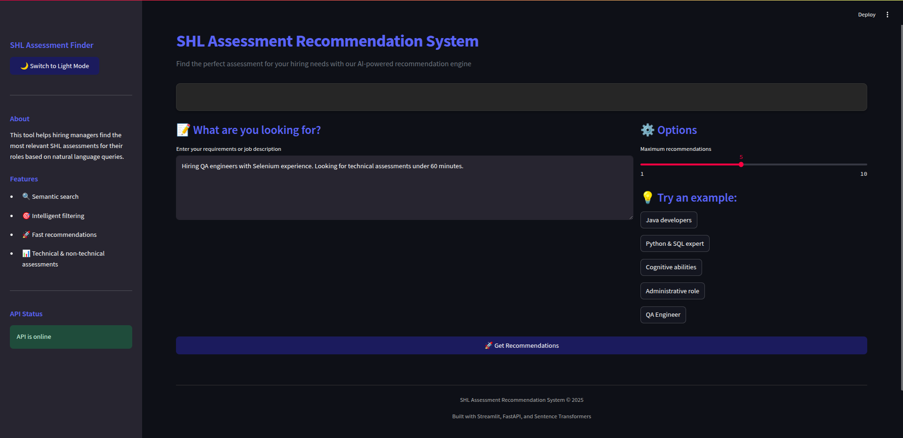

# SHL Assessment Recommendation System

This system provides intelligent recommendations for SHL assessments based on natural language queries, job descriptions, or specific requirements.
(This is for SHL assessment)

- **Proposed Solution** -> [Solution](Solution.md)
- **Proposed Architecture** -> [Architecture](Architecture.md)

## Features

- **Semantic Search Engine**: Uses advanced NLP with Sentence Transformers to find the most relevant assessments
- **Constraint Filtering**: Intelligently extracts and applies constraints like duration, remote testing support, and assessment type
- **Modern Streamlit UI**: Clean, responsive interface with dark/light mode support
- **RESTful API**: Backend API built with FastAPI for easy integration
- **Interactive Experience**: User-friendly interface with loading animations, example queries, and visual guidance
- **Comprehensive Assessment Catalog**: Detailed information on technical, cognitive, personality, and role-specific assessments
- **Vector Database**: ChromaDB for efficient semantic searching and recommendation retrieval
- **Visualization**: Clean badge system to display assessment attributes

## Setup

### Prerequisites

- Python 3.10 or higher
- Virtual environment (recommended)

### Installation

1. Clone the repository:

```bash
git clone https://github.com/Abhinavexists/SHL-Assessment.git
cd SHL-Assessment
```

2. Create and activate a virtual environment:

- Using UV (Recommended)

```bash
uv venv
source .venv/bin/activate  # On Windows: venv\Scripts\activate
```

or

```bash
python -m venv .venv
source .venv/bin/activate  # On Windows: venv\Scripts\activate
```

3. Install dependencies:

```bash
pip install -r requirements.txt
```

### Running the Application

1. Rebuild the vector database (optional, if catalog has changed):

```bash
python app/scripts/rebuild_chroma.py
```

2. Start the API server:

```bash
uvicorn app.api.main:app --host 0.0.0.0 --port 8000
```

3. In a separate terminal, start the Streamlit interface:

```bash
streamlit run app/ui/streamlit_app.py
```

## Docker Setup

For easier deployment and consistent environment, you can use Docker:

### Prerequisites
- Docker and Docker Compose installed on your system

### Using Docker

1. Build the Docker image:

```bash
docker build -t shl-assessment .
```

2. Run the application:

```bash
docker run -p 8000:8000 -p 8501:8501 shl-assessment
```

### Using Docker Compose

1. Start all services:

```bash
docker-compose up
```

3. To stop the services:

```bash
docker-compose down
```

## System Components

### API (FastAPI)

- `app/api/main.py`: Main API entry point with recommendation endpoints
- API endpoints:
  - GET `/health`: Health check endpoint
  - POST `/recommend`: Recommendation endpoint accepting queries and constraints

### Recommendation Engine

- `app/models/recommendation_engine.py`: Core semantic search and recommendation logic
- Uses ChromaDB for vector embeddings and semantic search
- Supports constraint-based filtering and scoring

### Streamlit Interface

- `app/ui/streamlit_app.py`: Modern Streamlit web interface with:
  - Dark/light mode toggle
  - Two-column layout for better organization
  - Interactive assessment cards with badges
  - Example queries for easy testing
  - Comparison feature for selected assessments
  - Loading animations and progress indicators

### Data Storage

- `app/data/shl_catalog.json`: Comprehensive catalog of 45 SHL assessments with detailed descriptions
- `app/data/chroma_db/`: Vector database storing embeddings for efficient semantic search

### Data Collection

- `app/scripts/scrape_catalog.py`: Advanced scraper for SHL product catalog
- `app/scripts/rebuild_chroma.py`: Tool to rebuild the vector database from the catalog

## User Interface Features

### Assessment Cards

Each assessment is displayed with:

- Name and ranking
- Type indicator (Technical, Cognitive, Personality, Role-specific)
- Remote testing support indicator
- Adaptive testing support indicator
- Duration information
- Detailed description with "Read more" expansion
- Links to view the assessment on SHL website

### Search and Filtering

- Natural language query input
- Maximum results selection
- Example queries to quickly test the system
- Guidance for refining searches when no results are found

### Visual Elements

- Color-coded badges for assessment attributes
- Progress indicators during search
- Responsive layout that works on different screen sizes
- Theme toggling between light and dark modes

## Usage Examples

### Example Queries

- "I am hiring Java developers who can collaborate with business teams. Looking for assessments that can be completed in 40 minutes."
- "Looking to hire professionals proficient in Python, SQL and JavaScript. Need an assessment package with max duration of 60 minutes."
- "I am hiring for an analyst role and want to screen using cognitive tests, within 45 mins."
- "ICICI Bank Assistant Admin, Experience required 0-2 years, test should be 30-40 mins long"
- "Hiring QA engineers with Selenium experience. Looking for technical assessments under 60 minutes."

## How It Works

1. **Query Processing**: The system processes natural language queries to understand requirements
2. **Semantic Search**: Using Sentence Transformers, the system finds semantically similar assessments
3. **Constraint Extraction**: Automatically identifies constraints like duration or type from the query
4. **Recommendation Ranking**: Scores and ranks assessments based on relevance and constraint matching
5. **Result Presentation**: Displays recommended assessments with detailed information

## Technical Architecture

- **Frontend**: Streamlit with CSS customization for modern UI components
- **Backend API**: FastAPI for fast, asynchronous API endpoints
- **Vector Database**: ChromaDB for efficient similarity search
- **Embedding Model**: SentenceTransformers for high-quality text embeddings
- **Data Processing**: Python scripts for data collection and preprocessing

## API Response Format

The recommendation API endpoint returns a JSON response with the following structure:

```json
{
  "recommended_assessments": [
    {
      "url": "https://www.shl.com/solutions/products/product-catalog/view/python-new/",
      "adaptive_support": "No",
      "description": "Multi-choice test that measures the knowledge of Python programming, databases, modules and library.",
      "duration": 11,
      "remote_support": "Yes",
      "test_type": ["Knowledge & Skills"]
    },
    {
      "url": "https://www.shl.com/solutions/products/product-catalog/view/technology-professional-8-0-job-focused-assessment/",
      "adaptive_support": "No",
      "description": "The Technology Job Focused Assessment assesses key behavioral attributes required for success in fast-paced environments.",
      "duration": 16,
      "remote_support": "Yes",
      "test_type": ["Competencies", "Personality & Behaviour"]
    }
  ]
}
```

Each assessment in the recommendations includes:
- `url`: Direct link to the assessment on the SHL website
- `adaptive_support`: Whether the assessment supports adaptive testing ("Yes" or "No")
- `description`: Brief description of the assessment
- `duration`: Estimated time to complete the assessment in minutes
- `remote_support`: Whether the assessment can be taken remotely ("Yes" or "No")
- `test_type`: Array of assessment types/categories

## Troubleshooting

- If the API returns an empty recommendation list, check if the ChromaDB collection is properly initialized
- If the Streamlit UI can't connect to the API, verify the API server is running on port 8000
- For scraping issues, check the debug response in `app/data/debug_response.html`

## Rebuilding ChromaDB and Testing

### Rebuilding ChromaDB
When assessment data is updated, you need to rebuild the ChromaDB collection to reflect these changes:

```bash
python app/scripts/rebuild_chroma.py
```

This script performs the following actions:
1. Deletes the existing ChromaDB directory if it exists
2. Loads the assessment data from `app/data/shl_catalog.json`
3. Creates a new ChromaDB collection with updated embeddings
4. Precomputes embeddings for common query terms to improve performance

### Testing the System

To verify the system is working correctly:

1. Test the API directly:
```bash
curl -X POST "http://localhost:8000/recommend" \
  -H "Content-Type: application/json" \
  -d '{"query": "Python developer assessment", "max_results": 5}'
```

2. Run the automated tests:
```bash
pytest app/tests/
```

3. Manual testing via the Streamlit UI:

   - Try the example queries in the UI
   - Test constraint extraction by including duration, assessment type, or other requirements
   - Verify that the loading indicators and error handling work as expected

### Performance Monitoring

To monitor system performance:

- API response times can be checked in the server logs
- ChromaDB query performance is logged at the DEBUG level
- For production deployments, consider adding Prometheus metrics

## License

MIT License
This project is licensed under the MIT License - see the LICENSE file for details.

## Web Interface Preview

[]([https://www.youtube.com/watch?v=VIDEO_ID](https://youtu.be/L_w4DZya9lk))

